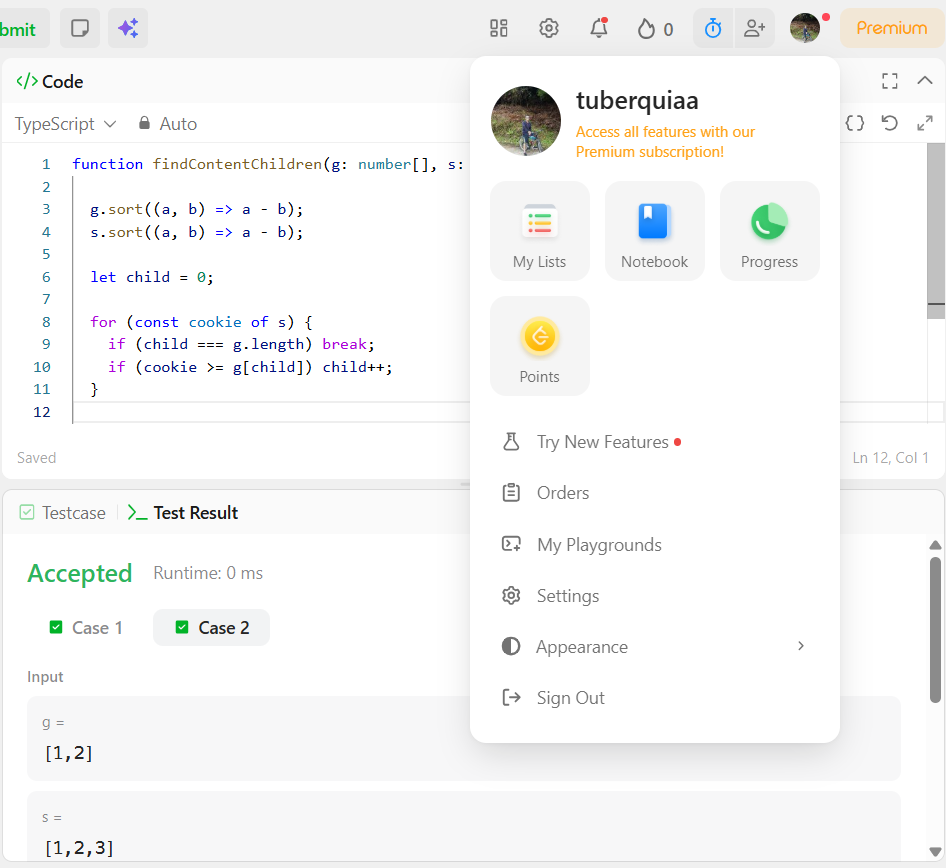
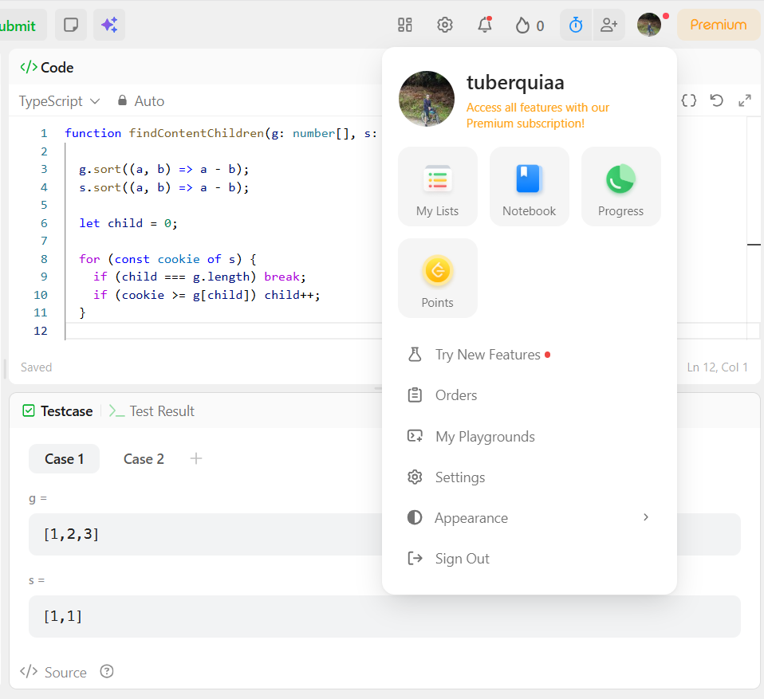

url task leetcode : https://leetcode.com/problems/assign-cookies/

# Assign Cookies

`g[i]` es el factor de gula del niño i y `s[j]` el tamano de la galleta j. Cada niño recibe a lo sumo una galleta y queda satisfecho si `s[j] >= g[i]`. Maximizar el numero de niños satisfechos.

**Criterio greedy:** ordenar ambos arreglos de menor a mayor y emparejar, luego a cada niño (del menos exigente al mas) se le da la galleta mas pequeña que aun lo satisface. Una galleta demasiado chica no le sirve a los niños mas exigentes. De este modo, no se desperdicia una galleta grande en un niño facil de contentar.

**Complejidad:** O(n log n + m log m) tiempo (ordenar domina; el emparejamiento es una sola pasada O(n + m)) y O(1) espacio extra.

